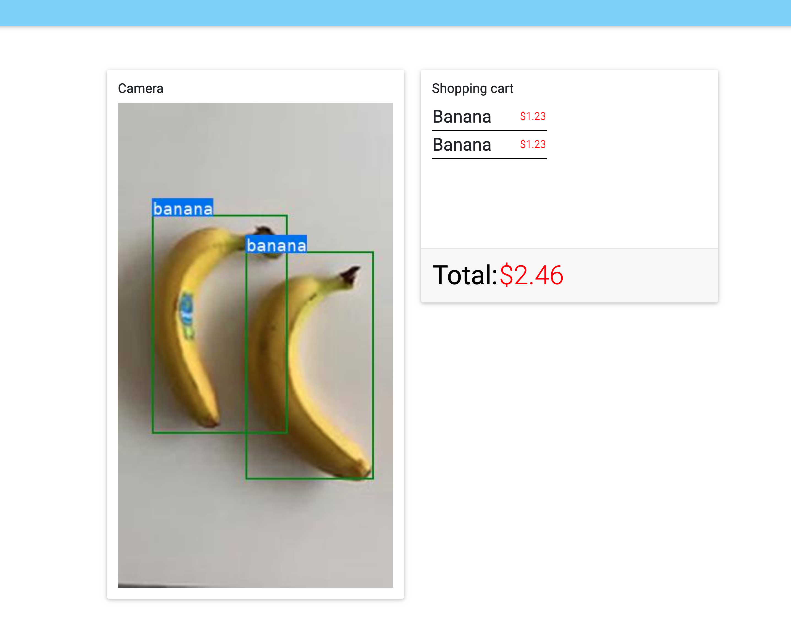

 [//]: # ( ** )  
 [//]: # ( * Project: ai-shopping-demo)  
 [//]: # ( * File: README.md)  
 [//]: # ( * Author: Emil Nilsson)  
 [//]: # ( * Contact: emil.nilsson@nutanix.com)  
 [//]: # ( ** )  

# Ai shopping demo

Simple demo built using MDBootstrap, Express, Socket.io, NATS.io and Node to display a video feed and relevant data in a shopping cart.



The node server is listening on port 4000

The application expects 2 environmental variables to be set
* NATS_ENDPOINT Should be pointing at NATS topic
* NATS_PORT_4222_TCP Should be pointing at NATS host

## Run using docker

```bash
docker build -t your/tag:latest .
docker run -p 4000:4000 your/tag:latest
```

## Example k8s deployment

```YAML

kind: Deployment
apiVersion: apps/v1
metadata:
  name: ai-shopping-demo
spec:
  replicas: 1
  selector:
    matchLabels:
      app: ai-shopping-demo
  template:
    metadata:
      labels:
        app: ai-shopping-demo
    spec:
      containers:
      - name: app1
        image: your/image:tag
        imagePullPolicy: Always
        ports:
        - name: http
          containerPort: 4000
          hostPort: 4000
        env:
        - name: NATS_ENDPOINT
          value: "topic"

---
apiVersion: v1
kind: Service
metadata:
  name: service-app
  labels:
    # This will show the play button in the ui -- do not change
    uilabel: show-play-http-aba0339ef5aea2602129ed45a63d7d7f
spec:
  type: NodePort
  ports:
    - port: 4000
  selector:
    app: ai-shopping-demo

````

Project: ai-shopping-demo 
File: README.md
Author: Emil Nilsson  
Contact: emil.nilsson@nutanix.com  