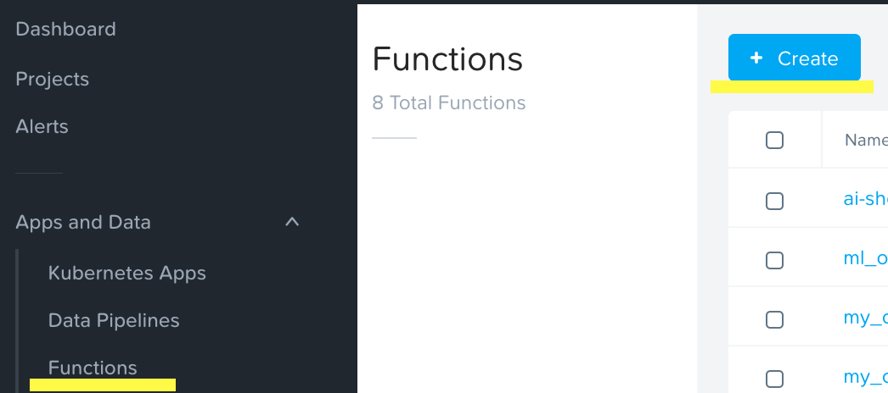
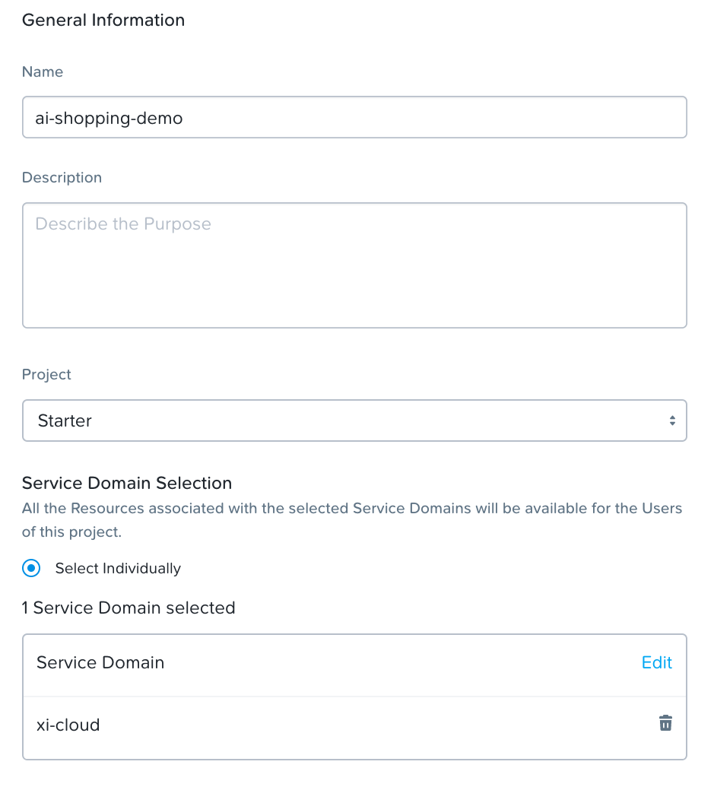
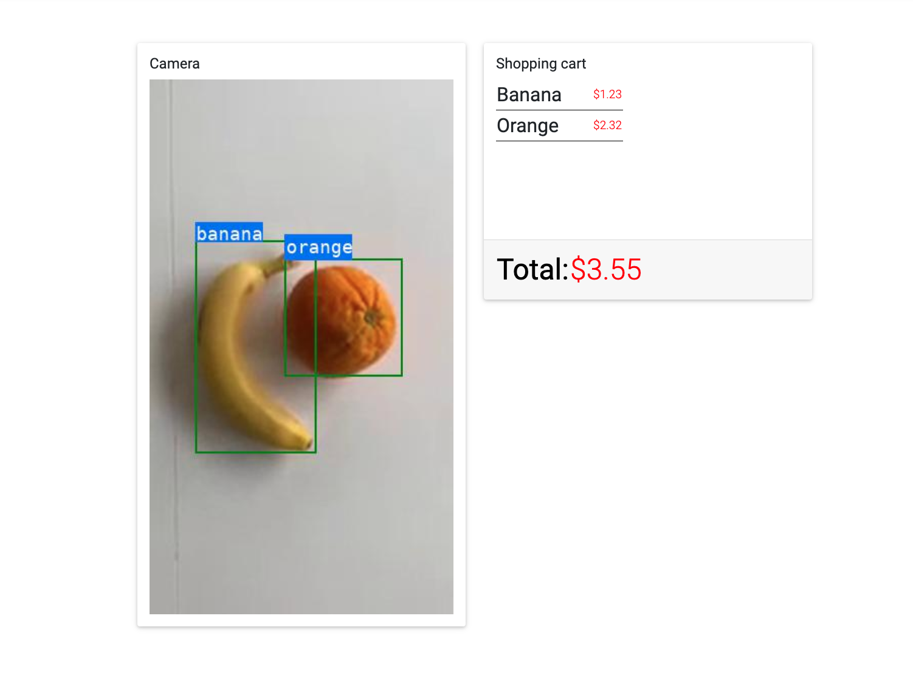

# Ai Shopping demo

## Step by step guide

Simple step by step guide for setting up the Ai Shopping demo in Xi IoT Portal.

## Step 1 - Add value to the youtube-8m category

The first step is the add a new value to the youtube-8m category.
Open the ```Categories``` section in the menu and select ```youtube-8m``` and click on ```Edit```


Click on ```Add value``` and type ```fruit```, click the checkbox and then click ```Update```


## Step 2 - Modifying the Data Source

The Ai Shopping demo uses the built in YouTube-8m Data source. We need to add a new URL to this data source.
Click on ```Data sources``` in the menu. Select the checkbox in front of ```youtube-8m``` then click on the ```Edit``` button


Click on ```Add New URL```


Enter ```fruit``` as a name and ```https://youtu.be/qKAxfSMk9Vs``` as the URL.
Click on ```Next``` down in the right corner.

Now we need to assign our new URL to the category that we created in the first step.
Click ```Add```. Under ```Select Fields``` select the dropdown and choose ```Select Fields```.
Select the checkbox for our ```fruit``` URL. Click ```OK```.


Under ```Attribute``` select ```youtube-8m``` and select our ```fruit``` value. Click on ```Update``` down in the right corner.


## Step 3 - Add ai-shopping-function

Click on ```Functions``` in the menu. Click on ```+ Create```


Give it a name ```ai-shopping-func``` and select ```Starter``` under project, ```Python``` as the Language and ```Tensorflow Python``` as the Runtime. Click ```Next```.


Paste in this function:
```python
#!/usr/bin/python


import cStringIO
import json
import io
import numpy as np
from PIL import Image
from PIL import ImageDraw
from PIL import ImageFont
import tensorflow as tf
import logging
import threading
from Queue import Queue
import base64

BASE_PATH = "/mllib/objectdetection"

# ssd_inception_v2_coco	latency - 42ms
PATH_TO_CKPT = BASE_PATH + '/ssd_inception_v2_coco_2017_11_17/frozen_inference_graph.pb'
PATH_TO_LABELS = BASE_PATH + '/mscoco_label_map.pbtxt'

boxes = None
scores = None
classes = None
num_detections = None
frame_count = 0

labels = ["dummy",
          "person",
          "bicycle",
          "car",
          "motorcycle",
          "airplane",
          "bus",
          "train",
          "truck",
          "boat",
          "traffic light",
          "fire hydrant",
          "street sign",
          "stop sign",
          "parking meter",
          "bench",
          "bird",
          "cat",
          "dog",
          "horse",
          "sheep",
          "cow",
          "elephant",
          "bear",
          "zebra",
          "giraffe",
          "hat",
          "backpack",
          "umbrella",
          "shoe",
          "eye glasses",
          "handbag",
          "tie",
          "suitcase",
          "frisbee",
          "skis",
          "snowboard",
          "sports ball",
          "kite",
          "baseball bat",
          "baseball glove",
          "skateboard",
          "surfboard",
          "tennis racket",
          "bottle",
          "plate",
          "wine glass",
          "cup",
          "fork",
          "knife",
          "spoon",
          "bowl",
          "banana",
          "apple",
          "sandwich",
          "orange",
          "broccoli",
          "carrot",
          "hot dog",
          "pizza",
          "donut",
          "cake",
          "chair",
          "couch",
          "potted plant",
          "bed",
          "mirror",
          "dining table",
          "window",
          "desk",
          "toilet",
          "door",
          "tv",
          "laptop",
          "mouse",
          "remote",
          "keyboard",
          "cell phone",
          "microwave",
          "oven",
          "toaster",
          "sink",
          "refrigerator",
          "blender",
          "book",
          "clock",
          "vase",
          "scissors",
          "teddy bear",
          "hair drier",
          "toothbrush",
          "hair brush"]


class ObjectDetector(object):

    def __init__(self):
        self.detection_graph = self._build_graph()
        self.sess = tf.Session(graph=self.detection_graph)
        logging.info("Loaded tensorflow gpu")

    def _build_graph(self):
        detection_graph = tf.Graph()
        with detection_graph.as_default():
            od_graph_def = tf.GraphDef()
            with tf.gfile.GFile(PATH_TO_CKPT, 'rb') as fid:
                serialized_graph = fid.read()
                od_graph_def.ParseFromString(serialized_graph)
                tf.import_graph_def(od_graph_def, name='')

        return detection_graph

    def _load_image_into_numpy_array(self, image):
        (im_width, im_height) = image.size
        return np.array(image.getdata()).reshape(
            (im_height, im_width, 3)).astype(np.uint8)

    def detect(self, image):
        image_np = self._load_image_into_numpy_array(image)
        image_np_expanded = np.expand_dims(image_np, axis=0)

        graph = self.detection_graph
        image_tensor = graph.get_tensor_by_name('image_tensor:0')
        boxes = graph.get_tensor_by_name('detection_boxes:0')
        scores = graph.get_tensor_by_name('detection_scores:0')
        classes = graph.get_tensor_by_name('detection_classes:0')
        num_detections = graph.get_tensor_by_name('num_detections:0')

        (boxes, scores, classes, num_detections) = self.sess.run(
            [boxes, scores, classes, num_detections],
            feed_dict={image_tensor: image_np_expanded})

        boxes, scores, classes, num_detections = map(
            np.squeeze, [boxes, scores, classes, num_detections])

        return boxes, scores, classes.astype(int), num_detections

# one of the few fonts available inside tensorflow-python image
font = ImageFont.truetype("DejaVuSansMono.ttf", 18)

def draw_bounding_box_on_image(image, box, color='green', thickness=2, display_str_list=()):
    draw = ImageDraw.Draw(image)
    im_width, im_height = image.size
    ymin, xmin, ymax, xmax = box
    (left, right, top, bottom) = (xmin * im_width, xmax * im_width,
                                  ymin * im_height, ymax * im_height)
    draw.line([(left, top), (left, bottom), (right, bottom),
               (right, top), (left, top)], width=thickness, fill=color)

    # If the total height of the display strings added to the top of the bounding
    # box exceeds the top of the image, stack the strings below the bounding box
    # instead of above.
    display_str_heights = [font.getsize(ds)[1] for ds in display_str_list]
    # Each display_str has a top and bottom margin of 0.05x.
    total_display_str_height = (1 + 2 * 0.05) * sum(display_str_heights)

    if top > total_display_str_height:
        text_bottom = top
    else:
        text_bottom = bottom + total_display_str_height
    # Reverse list and print from bottom to top.
    for display_str in display_str_list[::-1]:
        text_width, text_height = font.getsize(display_str)
        margin = np.ceil(0.05 * text_height)
        draw.rectangle([(left, text_bottom - text_height - 2 * margin),
                        (left + text_width, text_bottom)],
                       fill='#216df3')
        draw.text((left + margin, text_bottom - text_height - margin), display_str, fill="white",
                  font=font)
        text_bottom -= text_height - 2 * margin


def detect_objects(data):
    global boxes
    global scores
    global classes
    global num_detections
    global frame_count
    
    image = Image.open(io.BytesIO(data)).convert('RGB')
    detections = []

    basewidth = 300
    wpercent = (basewidth/float(image.size[0]))
    hsize = int((float(image.size[1])*float(wpercent)))
    image = image.resize((basewidth,hsize), Image.ANTIALIAS)

    if frame_count % 24 == 0:
        boxes, scores, classes, num_detections = client.detect(image)
    num_boxes = 0
    if frame_count % 1 == 0:
        for i in range(num_detections):
            if num_boxes > 3:
                break
            cls = classes[i]
            if scores[i] < 0.2:
                continue
            detections.append(labels[cls])
            draw_bounding_box_on_image(
                image, boxes[i], display_str_list=[labels[cls]])
            num_boxes = num_boxes + 1
    buffer = cStringIO.StringIO()
    image.save(buffer, format="JPEG")
    img_str = buffer.getvalue()
    frame_count = frame_count + 1

    if frame_count % 100 == 0:
        logging.info(frame_count)
    return [detections,img_str]

def read_frame():
    while True:
        frame = inQ.get()
        output_data = detect_objects(frame)
        outQ.put(output_data)

client = ObjectDetector()
inQ = Queue(200)
outQ = Queue(200)

read_thr = threading.Thread(target=read_frame)
read_thr.name = "inferenceRead"
read_thr.daemon = True
read_thr.start()

def main(ctx, msg):
    if inQ.full():
        inQ.get()
    inQ.put(msg)

    while not outQ.empty():
        output = {}
        out_q = outQ.get()
        output['frame'] = base64.b64encode(out_q[1])
        output['json_payload'] = {'detections' : out_q[0]}
        ctx.send(json.dumps(output))
    return
```

Click on ```Create``` down in the right corner.
> If you are experiencing issues running the function, try copy/paste from the source file located here: ["Source"](https://github.com/voxic/ai-shopping-demo/blob/master/serverless/ai-detect-func.py)

## Step 4 - Create a Data pipeline

Next step is to connect our data source to our function using a ```Data pipeline```.
Click on ```Data Pipelines``` in the menu and then click on ```+ Create```


Select the ```Starter``` project.
Under ```Input``` select ```Data source``` and then ```youtube-8m``` and ```fruit```.
Under ```Transformation``` select our ```ai-shopping-func```.
Under ```Output``` select ```Publish to service domain```,  
select ```Realtime Data Stream``` as Endpoint type and enter ```data``` as Endpoint Name.


Click on ```Create``` down in the right corner.

## Step 5 - Deploy Kubernetes Application

The next and final step is to deploy the Ai Shopping demo kubernetes application.
Select ```Kubernetes Apps``` from the menu. Click on ```+ Create```


Enter a name for our application and select the ```Starter``` project.
Select the ```xi-cloud``` Service Domain.
Click on ```Next``` down in the right corner.


Paste in this deployment configuration:
```yaml
kind: Deployment
apiVersion: apps/v1
metadata:
  name: ai-shopping-demo
spec:
  replicas: 1
  selector:
    matchLabels:
      app: ai-shopping-demo
  template:
    metadata:
      labels:
        app: ai-shopping-demo
    spec:
      containers:
      - name: app1
        image: voxic/ai-shopping-demo:v3
        imagePullPolicy: Always
        ports:
        - name: http
          containerPort: 4000
          hostPort: 4000
        env:
        - name: NATS_ENDPOINT
          value: "data"

---
apiVersion: v1
kind: Service
metadata:
  name: service-app
  labels:
    # This will show the play button in the ui -- do not change
    uilabel: show-play-http-aba0339ef5aea2602129ed45a63d7d7f
spec:
  type: NodePort
  ports:
    - port: 4000
  selector:
    app: ai-shopping-demo
```

Click on ```Next``` down in the right corner. We don't need any outputs so click on ```Create``` down in the right corner. 

We have now finished the setup of the Ai-shopping-demo.

## Running the Demo
To run the demo first start the Kubernetes application.
Select ```Kubernetes Apps``` from the menu, hover over the ```Actions``` dropdown on our application and select ```Start```.


Wait a few moment and then click on ```View App UI```. The application will open in a new TAB.
> If you get a error when opening the App UI, refresh the Xi IoT portal page and try again


After the UI have loaded successfully the next step is to start the data pipeline.
Click on ```Data pipelines``` in the menu. Hover over the ```Actions``` dropdown on our data pipeline and select ```Start```.

Switch back to the application TAB and wait a few seconds and the UI should update.


> The demo runs for ~30 seconds, to re run the demo ```Stop and Start``` the data pipeline.
